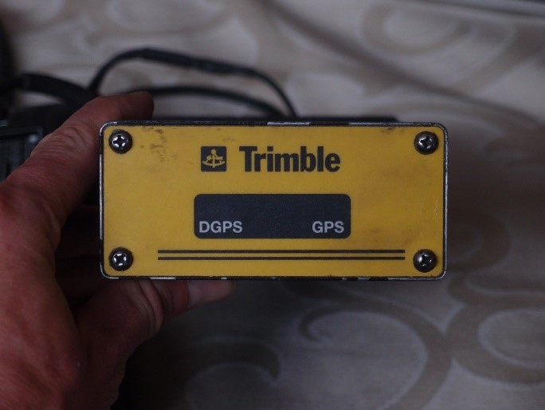
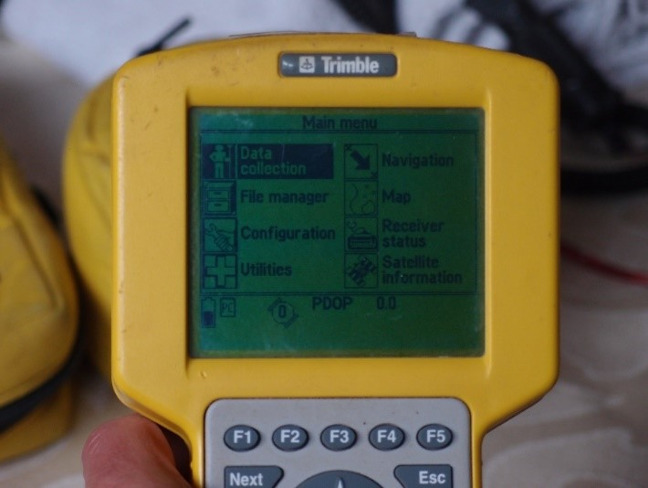
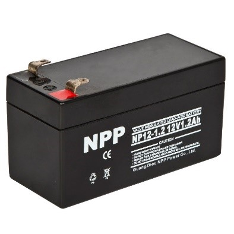

# dGPS Data collection with the Trimble Pro XRS Pathfinder (L1) backpack

## Introduction

The Trimble Pro XRS units (Fig. \ref{Fig:trimble_pro_xrs_dgps}) and the TSC-1 receivers (Fig. \ref{Fig:trimble_tsc1_receiver}) are robust
and sturdy and rely on the GPS L1 and P signal (no L2 signal) and
provide centi- to decimeter accuracy. We either mount these units on the
top of the car with a magnet, or carry them in a backpack for off-road
measurements. The basic steps are outlined in this document:

1.  Setup the unit and collect data, making sure to set the antenna
    height

2.  Download the dGPS data from the units and covert them to SSF using
    Trimble Data Transfer Utility (free program:
    <http://www.trimble.com/datatransfer/>) and then RINEX files using
    Trimble Pathfinder Office (email <ben.purinton@gmail.com> if this
    program is not available to you)

3.  Correct the data in RTKLIB (free program: <http://www.rtklib.com/>)

    *   **See second manual *dGPS Correction with RTKLIB***

## Setup: Problems and Solutions

When carried in the backpack, these units use lead-acid sealed 12V
batteries (Fig. \ref{Fig:lead_acid_battery}). When mounted in the car we exchange the power
adapter from the clamps used on these batteries to the car outlet
adapter. Please note that the dGPS units occasionally do not work
properly (low battery or cannot connect to dGPS warnings). In this case,
the problem (and solution) is:

1. The lead-acid battery is low in charge (check the battery with a multi-meter and charge it if needed)

2. The clamps connecting the battery to the units are not tight (tape the clamps to the prongs on the battery)

3. One or more of the cables connecting everything are broken or not
 tight (try switching the cables around and making sure they are
 connected tightly)

4. The batteries in the back of the hand-held units (Fig. \ref{Fig:trimble_tsc1_receiver_battery}) are loose
 or old (try switching the batteries around or exchanging them)

**Note:** One or more of these steps usually work to get the unit working, but it may take some time to find the problem, so don’t get frustrated.

## Collecting Data

Once we have the unit setup in the car or in the backpack, we are ready
to log data. Follow the instructions in Figure \ref{Fig:trimble_data_collect_1}-\ref{Fig:trimble_data_collect_4}.

# Downloading data from Trimble Pro XRS

## Install Data Transfer Utility and Pathfinder Office

Install and open the Data Transfer Utility from Trimble (free program:
<http://www.trimble.com/datatransfer/>). This program will transfer the
data from the CF card in the TSC-1 unit to an SSF format, which can be
converted to RINEX files in Trimble Pathfinder Office (email
<purinton@uni-potsdam.com> if this program is not available to you).

## Downloading data from TSC-1 with Asset Surveyor (5.2x) – PCMCIA or CF card

Use the following steps to transfer data from the CF card to the
computer for the TSC-1 (Figure \ref{Fig:trimble_data_collect_5}-\ref{Fig:trimble_data_collect_8}).

# Converting data to SSF and RINEX

Now that we have the files for the day, we can change them to SSF format
with the Data Transfer Utility and then to RINEX in Pathfinder Office.
RINEX files include observations (.obs) and navigation (.nav). Follow
the steps in Figure \ref{Fig:trimble_data_transfer_1}-\ref{Fig:trimble_data_transfer_6}).

